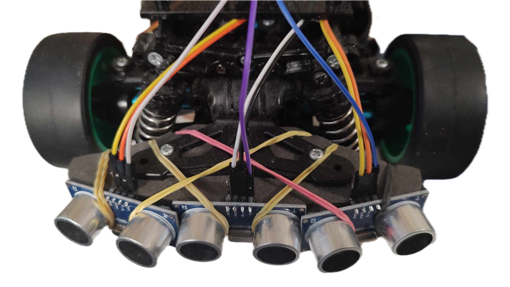

# Bumper Sensor Firmware



## Overview

Welcome to the Bumper Sensor Firmware repository! This firmware is designed for controlling and reading data from an array of HC-SR04 ultrasonic sensors. It provides an efficient and reliable way to integrate bumper sensors into your IoT projects.

## Features

- **Multi-Sensor Support**: The firmware supports multiple bumper sensors, allowing you to monitor obstacles from different directions simultaneously.

- **Real-time Data Transmission**: Sensor data is transmitted in real-time to enable quick decision-making in your applications.

- **Event-based Communication**: The firmware utilizes FreeRTOS event groups for efficient synchronization and communication between tasks.

- **Error Handling**: Comprehensive error handling ensures robust operation even in challenging conditions.

## Getting Started

To get started with the Bumper Sensor Firmware, follow these steps:

1. **Clone the Repository**: Clone this repository to your local machine using the following command:

```
git clone https://github.com/robokrishan/embed-vehicle-firmware.git
```


2. **Set Up Development Environment**: Set up ESP-IDF v5.0.4 by following the official documentation from Espressif.

3. **Configure Sensor Modules**: Modify the configuration file (`device_config.h`) to specify the GPIO pins for your sensor modules.

4. **Build and Flash Firmware**: Build and flash the firmware using the following command:

```
idf.py build flash
```

5. **Monitor Sensor Data**: Once the firmware is running, monitor the sensor data output to ensure proper functionality using the following command:

```
idf.py monitor
```

## Contributing

Contributions to the Bumper Sensor Firmware are welcome! If you encounter any issues, have ideas for improvements, or would like to contribute new features, feel free to submit a pull request.

## License

This project is licensed under the MIT License - see the [LICENSE](LICENSE) file for details.

## Acknowledgements

- Special thanks to the contributors of the FreeRTOS and ESP-IDF frameworks for providing the foundation for this firmware.

- Inspired by the need for reliable obstacle detection in autonomous robotic systems.

## Contact

For any inquiries or support, please contact [Harit Krishan](mailto:haritkrishan176@gmail.com).